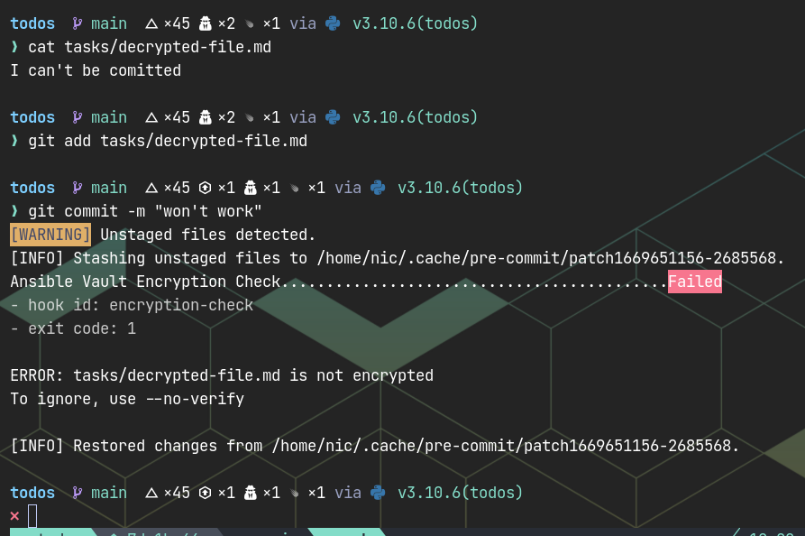

# Ansible-vault-pre-commit

A [pre-commit](http://pre-commit.com) hook that check for ansible-vault
encryption

## Example



## Hooks

### encryption-check
Verifies that vault files are encrypted. Defaults to checking files starting
with `vault`, ending with `.vault.yml` or ending in `.vault`

```yaml
# usage
repos:
  - repo: https://github.com/pypeaday/ansible-vault-pre-commit
    rev: v1.0
    hooks:
      - id: encryption-check
        # override files to all files in ./tasks/ directory
        files: ((^|/)tasks)

```

# Credit

[iamthefij](https://git.iamthefij.com/iamthefij/ansible-pre-commit/src/branch/master)
